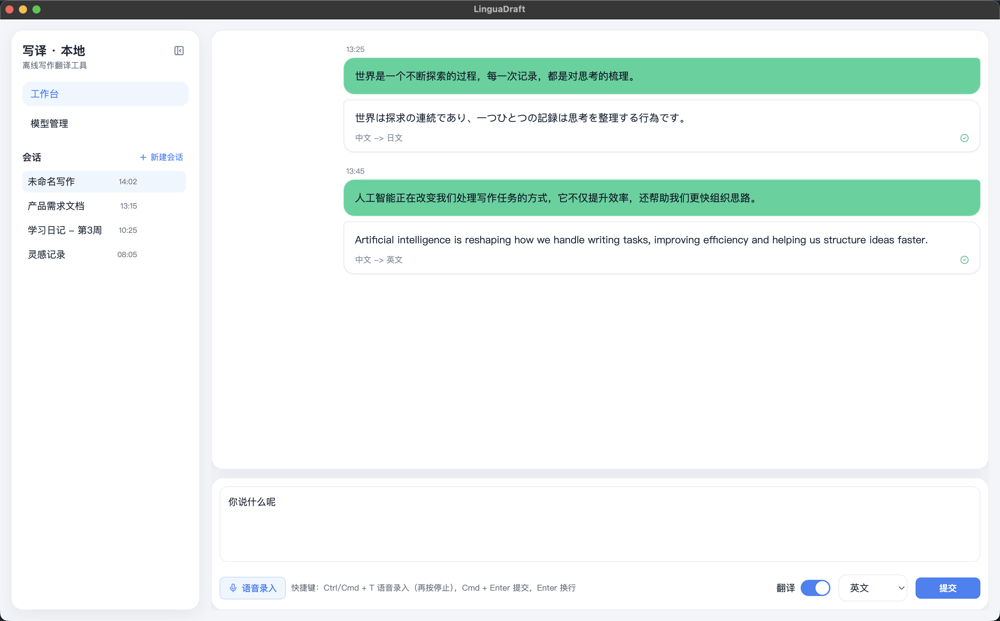

# LinguaDraft

基于 `Electron + React + TypeScript + Vite + Tailwind CSS + Zustand` 的本地写作翻译工具。


## 本地开发

```bash
pnpm install
pnpm approve-builds
pnpm setup:sidecar
pnpm dev
```

说明：

- 首次安装后需要执行 `pnpm approve-builds` 并允许 `electron`
- `pnpm setup:sidecar` 会准备本地 Python sidecar 依赖

## 项目目录

```text
.
├── electron/                 # Electron 主进程、preload、IPC、runtime
├── src/                      # Renderer（React 页面、组件、状态、服务）
├── services/ai-sidecar/      # Python sidecar（ASR/翻译推理）
├── local-model/              # 本地模型与模型清单
├── docs/                     # 设计文档与截图
├── tests/e2e/                # E2E 测试
├── scripts/                  # 工具脚本
└── .github/workflows/        # CI/CD 工作流
```

## 文档索引

- [架构设计说明](./docs/architecture-design.md)：当前系统分层、翻译调用链路、时序图与排障路径。
- [MVP 需求提示词](./docs/mvp-prompt.md)：桌面端 MVP 的页面结构、主流程与实现约束。
- [本地模型最终方案](./docs/local-prompt.md)：本地模型落地要求、内置模型策略与工程约束。
- [模型技术选型对比](./docs/model-selection-comparison.md)：ASR/翻译/识别模型方案对比与选型结论。
- [语言识别选型说明](./docs/language-detect.md)：文本语种识别方案评估与阶段性决策。
- [翻译质量问题记录](./docs/translation-quality-issue.md)：当前翻译异常现象、定位过程与结论。
- [模型翻译问题记录](./docs/模型翻译问题.md)：模型输出异常案例与处理建议。

## TODO

- 接通更多本地翻译模型下载与安装（除内置中英模型外的其他语向）。
- 完善模型下载任务管理（重试、断点续传、失败恢复）。
- 完善模型管理页状态与可观测性（更细粒度错误码与诊断信息）。
- 增加翻译与 ASR 的端到端回归测试覆盖（异常路径与边界输入）。
- 优化打包流程，确保内置模型与 sidecar 依赖在 macOS/Windows 安装包中一致可用。
