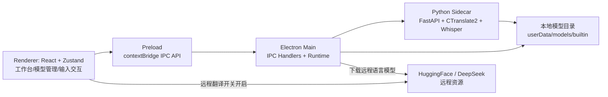
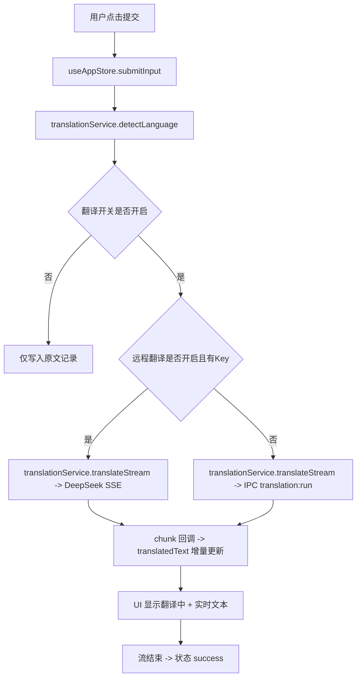
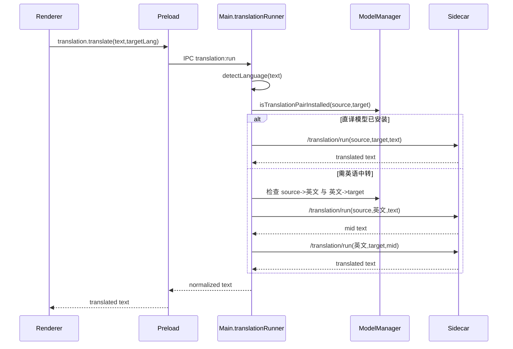
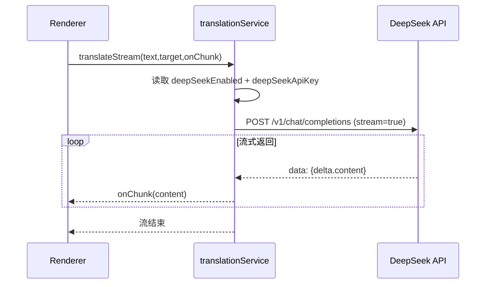
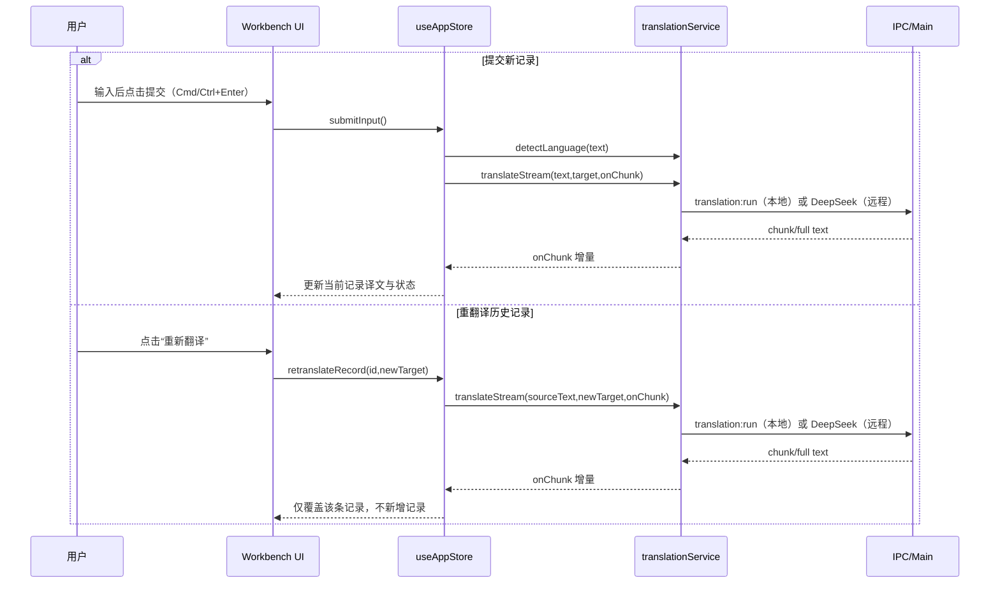

# LinguaDraft 架构设计说明（当前实现）

## 1. 文档目标

本文档基于当前代码实现，说明桌面端整体架构、关键模块职责，以及翻译调用相关的完整流程。
重点覆盖：

- Electron + React + Sidecar 的分层关系
- 翻译调用链路（远程 DeepSeek、本地离线）
- 本地翻译模型路由（直译 / 英语中转）
- 流式翻译与状态更新机制
- 异常处理与诊断路径

---

## 2. 总体架构

### 2.1 分层职责

- Renderer（`src/`）
  - UI、交互、状态管理（Zustand）
  - 翻译策略选择入口（远程优先开关）
  - 流式文本拼接与展示
- Preload（`electron/preload.ts`）
  - 暴露受控 API：`model/*`、`translation/*`、`asr/*`、`sidecar/diagnose`
- Main（`electron/`）
  - IPC 调度
  - 模型管理、翻译路由决策、ASR 调度
  - sidecar 生命周期管理
- Sidecar（`services/ai-sidecar/app/main.py`）
  - 离线推理执行（ASR/翻译）
  - 语言方向模型按目录动态加载

---

## 3. 关键模块设计

## 3.1 翻译服务（Renderer）

文件：`src/services/translationService.ts`

核心能力：

- `detectLanguage(text)`：启发式语言识别（中文/英文/日文/韩文）
- `translate(text, targetLang)`：
  - 若开启远程并有 API Key：调用 DeepSeek
  - 否则：调用 `window.linguaDraft.translation.translate(...)`
- `translateStream(text, targetLang, onChunk)`：
  - 远程：使用 DeepSeek `stream=true`，按 SSE chunk 增量回调
  - 本地：按句切分逐句调用本地翻译，再按词粒度模拟流式回调

## 3.2 翻译执行器（Main）

文件：`electron/runtime/translationRunner.ts`

职责：

- 调用 `lidRunner` 识别源语言并归一化
- 基于 `ModelManager` 判断语向模型是否安装
- 翻译路径：
  - 直译优先：`source -> target`
  - 无直译时，支持英语中转：`source -> 英文 -> target`
- 调用 sidecar 接口 `/translation/run`
- 对翻译结果做文本清洗（去 `▁`、去重复片段等）

## 3.3 模型管理器（Main）

文件：`electron/runtime/modelManager.ts`

职责：

- 启动时读取：
  - `local-model/manifest/builtin.manifest.json`
  - `local-model/manifest/remote.manifest.json`
- 维护模型状态：`not_installed/downloading/paused/installed/failed`
- 远程模型下载：从 HuggingFace 拉取 `model.bin/source.spm/target.spm` 到
  - `userData/models/builtin/translation/<pairCode>`
- 提供语向安装判断：`isTranslationPairInstalled(source, target)`

## 3.4 Sidecar 进程管理（Main）

文件：`electron/sidecar/processManager.ts`

职责：

- 启动 sidecar 前自检 Python 与依赖
- Python 选择策略：
  1. 优先打包内置 Python venv
  2. 不可用则自动创建 runtime venv 并安装 requirements
- 提供诊断信息：`getSidecarDiagnostics()`
  - Python 路径、来源、依赖状态、sidecar 入口、模型目录、最近错误

## 3.5 Sidecar（Python）

文件：`services/ai-sidecar/app/main.py`

能力：

- `/health`
- `/translation/run`：CTranslate2 + SentencePiece
- `/asr/transcribe`：faster-whisper
- 翻译模型目录规则：`translation/<sourceCode>-<targetCode>`

---

## 4. 翻译调用总流程

---

## 5. 本地离线翻译详细流程（Main + Sidecar）

### 5.1 离线翻译路由规则

- `source == target`：直接返回原文
- 有 `source -> target` 模型：走直译
- 无直译但有两段模型：`source -> 英文 -> target`
- 缺任一模型：抛出模型未安装错误

---

## 6. 远程翻译（DeepSeek）详细流程

特点：

- 远程开关开启且 Key 非空时，优先远程
- 仅输出译文本身（system prompt 已约束）
- 超时控制（25s / 30s）

---

## 7. 流式展示与状态机

翻译记录状态：

- `translating`：创建记录后立即进入
- `success`：流结束且有内容
- `failed`：异常或空结果

UI 更新方式（`useAppStore`）：

- `translated += chunk`
- 持续写回当前记录 `translatedText`
- 渲染层显示“已到达文本 + loading 图标”

---

## 8. 异常处理策略

## 8.1 翻译

- 语言识别失败：`语种识别失败，请输入更完整的句子`
- 模型缺失：`未安装 X->Y 模型`
- sidecar 返回 `translation-model-not-ready`：映射为模型未就绪
- sidecar 返回低质量：`翻译结果质量不稳定，请补充上下文后重试`

## 8.2 语音

- sidecar 未就绪：`语音服务未就绪，请重启应用后重试`
- 音频缺失：`未检测到可用音频`

---

## 9. 启动自检与排障

远程模型页提供 `Sidecar 启动自检` 面板（可刷新），用于快速定位：

- `selectedPython`
- `pythonSource`
- `depsReady`
- `sidecarEntry`
- `requirementsPath`
- `runtimeVenvRoot`
- `modelRoot`
- `healthReason`
- `lastError`

排障建议顺序：

1. 看 `depsReady` 是否为 `true`
2. 看 `modelRoot` 下内置模型文件是否齐全
3. 看 `healthReason/lastError` 的具体值

---

## 10. 提交翻译与重翻译入口时序

---

## 11. 当前已知边界

- 文本语言识别当前为启发式，未接入概率模型
- 远程流式依赖外网与 API Key
- 本地多语言翻译依赖语向模型齐备（部分语向通过英语中转）

---

## 12. 关键代码索引

- Renderer 翻译服务：`src/services/translationService.ts`
- 全局业务状态：`src/stores/useAppStore.ts`
- 翻译执行器：`electron/runtime/translationRunner.ts`
- 语言识别执行器：`electron/runtime/lidRunner.ts`
- 模型管理：`electron/runtime/modelManager.ts`
- Sidecar 进程管理：`electron/sidecar/processManager.ts`
- Sidecar 推理服务：`services/ai-sidecar/app/main.py`
- 模型页与自检面板：`src/pages/ModelsPage.tsx`
